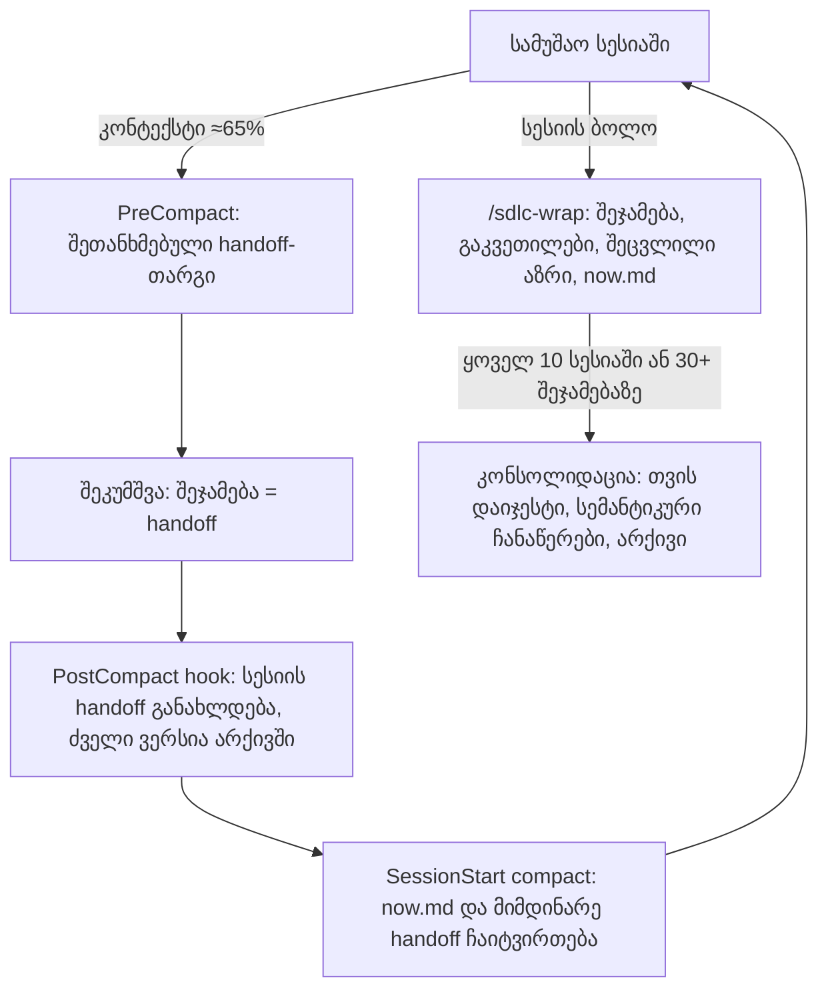

# კონტექსტი და მეხსიერება — დიზაინი v0

> **სტატუსი:** შეთანხმებულია ინტერვიუთი 2026-10-06 — [ADR-0004](../../docs/decisions/0004-context-and-memory.md) (`accepted`). hook-ები და პარამეტრები harness v0-ში აიწყობა.

## 1. რა პრობლემას ვხსნით

Claude-ის „მუშა მეხსიერება" მისი კონტექსტური ფანჯარაა (context window — ყველაფერი, რასაც მოდელი ერთდროულად „ხედავს": საუბარი, წაკითხული ფაილები, ინსტრუქციები). Sonnet 5.5-სა და Opus 5.5-ს ეს ფანჯარა 1 მილიონ ტოკენამდეა (ტოკენი — ტექსტის პატარა ნაჭერი, დაახლოებით ¾ სიტყვა). როცა ფანჯარა ივსება, ორი რამ ხდება. ჯერ ხარისხი ეცემა (context rot — რაც უფრო გრძელია კონტექსტი, მით უარესად ამჩნევს მოდელი მთავარს), ბოლოს კი საჭირო ხდება შეკუმშვა (compaction — საუბარი მისი შეჯამებით იცვლება).

შენი მოთხოვნები ასეთია: შეკუმშვა 60–70%-ზე; ყოველ შეკუმშვამდე ავტომატური handoff შეთანხმებული პრინციპებით; ერთ სესიაში 4–5 handoff არ უნდა დაგროვდეს, უნდა გაერთიანდეს; სესიის ბოლოს შეჯამება და მისი შენახვა. გარდა ამისა, დროთა განმავლობაში დაგროვილმა ჩანაწერებმა კონტექსტი არ უნდა გადატვირთოს. ამისთვის გვჭირდება ფენები: გრაფული მეხსიერება (მაგ. Obsidian), RAG (retrieval — საჭირო ნაწილის მოძებნა და მხოლოდ მისი ჩატვირთვა), ეპიზოდური მეხსიერება და შეცვლილი გადაწყვეტილებების აღმოჩენა.

## 2. მთავარი პრინციპი

**ჭეშმარიტების წყარო markdown ფაილებია git-ში. ყველა სხვა ინსტრუმენტი წარმოებული ინდექსია** — მისი წაშლა და ფაილებიდან ხელახლა აგება ნებისმიერ დროს შეიძლება.

ამის ოთხი მიზეზი არსებობს. პირველი: ინსტრუმენტები ფუჭდება ან მიტოვებულია ხოლმე — GSD 2026 წლის მაისიდან დაარქივებულია, შენი MemPalace-ის hook კი ამ კომპიუტერზე ჩუმად არ მუშაობს (იხ. §3), ფაილები კი რჩება. მეორე: git უფასოდ გვაძლევს დროით მეხსიერებას — ვინ, რა და როდის შეცვალა. მესამე: ფაილებს შენ თვითონ კითხულობ VS Code-ში ან Obsidian-ში. მეოთხე: playbook-ის წესით, ყოველ არტეფაქტს ერთი ჭეშმარიტების წყარო უნდა ჰქონდეს.

## 3. რა არსებობს უკვე ამ კომპიუტერზე (გაზომილია 2026-10-06)

- **გლობალური compaction hook-ები.** `~/.claude/hooks/active/precompact-wrap.sh` PreCompact-ზე ბეჭდავს handoff-ის ინსტრუქციას, რათა შეკუმშვის შეჯამება თავიდანვე handoff-ის ფორმით დაიწეროს. PostCompact-ზე კი ამ შეჯამებას (`compact_summary`) წერს `<პროექტი>/.claude/handoff-YYYY-MM-DD.md`-ში: დღის ყველა შეკუმშვა ერთ ფაილს ემატება. ⚠ ოფიციალური დოკუმენტაცია ადასტურებს, რომ PostCompact `compact_summary`-ს იღებს. ის კი, რომ PreCompact-ის stdout შეკუმშვის ინსტრუქციად იქცევა, დოკუმენტაციაში აღწერილი არ არის, ამიტომ ამას საცდელი შემოწმება (drill) სჭირდება. დოკუმენტირებული გზაა CLAUDE.md-ის „Compact instructions" სექცია, რომელიც უკვე დავამატეთ.
- **შეკუმშვის ზღვარი.** გლობალურად `autoCompactWindow: 620000` ტოკენია, ანუ 1M ფანჯრის ≈62%. პროექტის `.claude/settings.json` ამ მნიშვნელობას გადაფარავს.
- **Auto memory.** `~/.claude/projects/-Users-tornikebolokadze-Asterbit/memory/` — Claude-ის საკუთარი ჩანაწერები (ახლა ცარიელია). ყოველ სესიაზე მისი პირველი 200 ხაზი ან 25KB იტვირთება.
- **ჩანაწერების (transcript) შენახვის ვადა.** `cleanupPeriodDays` დაყენებული არ არის, ამიტომ მოქმედებს ნაგულისხმევი 30 დღე: ამის შემდეგ სესიების სრული ჩანაწერები ჩუმად იშლება.
- **MemPalace.** მონაცემები `~/.mempalace`-შია (5 MB; ცოდნის გრაფში 0 ფაქტი), მაგრამ Python-პაკეტი დაყენებული არ არის. ამიტომ გლობალური UserPromptSubmit hook (`python3 -m mempalace.mcp_server recall … || true`) ყოველ შეტყობინებაზე ჩუმად ვერ სრულდება. არ შევხებივარ: ეს გლობალური კონფიგურაციაა და შენი გადასაწყვეტია.
- **დაყენებულია:** Obsidian.app, Docker; uv-ხელსაწყოები chroma-mcp, hindsight-embed, lightrag-hku.

## 4. ფენები (შემოთავაზება)

| ფენა | რას ინახავს | სად | ვინ წერს | როდის შედის კონტექსტში | ლიმიტი |
|---|---|---|---|---|---|
| L0 მუშა მეხსიერება | მიმდინარე საუბარი | კონტექსტური ფანჯარა | — | ყოველთვის | შეკუმშვა ≈65%-ზე (შესათანხმებელი) |
| L1 Handoff | შეკუმშვის შეჯამება შეთანხმებული თარგით | `memory/episodic/handoffs/<session>.md` | PostCompact hook | შეკუმშვის შემდეგ | სესიაზე ერთი მოძრავი ფაილი |
| L1 სესიის შეჯამება | რა მოხდა სესიაში | `memory/episodic/sessions/` | `/sdlc-wrap` | საჭიროებისას (ძიებით) | ~1 გვერდი |
| L2 ახლანდელი მდგომარეობა | სად ვართ ახლა | `memory/now.md` | `/sdlc-wrap` | ყოველი სესიის დასაწყისში | ≤120 ხაზი |
| L2 სემანტიკური ჩანაწერები | მყარი ფაქტები: პრეფერენციები, ტერმინები, პროდუქტის ფაქტები | `memory/semantic/*.md` | კონსოლიდაცია | საჭიროებისას | თემაზე ერთი ფაილი |
| L2 პროცედურული | შესწორებები → წესები | `tasks/lessons.md` → `CLAUDE.md` | `/sdlc-wrap` | CLAUDE.md ყოველთვის | „ორჯერ → CLAUDE.md" |
| L3 გადაწყვეტილებები | ADR-ები ჩანაცვლების ჯაჭვით | `docs/decisions/` | ეტაპები 2, 3, 7, 8, 9 | ინდექსი საჭიროებისას | არასდროს გადაიწერება |
| L4 გრაფი | კავშირები ყველაფერს შორის | ბმულები + front matter → Obsidian-ის გრაფი | ავტომატურად (ბმულები ფაილებში) | — | — |
| L5 ძიება (RAG) | ძიება არქივში | ფაილებიდან აგებული ინდექსი | ინსტრუმენტი | ინსტრუმენტის მოთხოვნით | ემატება ზღვრის მიღწევისას |

## 5. ნაკადი

**რატომ არის handoff-ების გაერთიანება თითქმის უფასო.** მეორე შეკუმშვა უკვე შეიცავს პირველის შეჯამებას, მესამე — მეორისას და ასე შემდეგ. ამიტომ ბოლო handoff ყოველთვის მოიცავს ყველა წინას და სესიაზე ერთი „მოძრავი" ფაილი საკმარისია. რისკი ისაა, რომ შეჯამების შეჯამებაში ადრეული დეტალები შეიძლება დაიკარგოს. ამიტომ თარგი გადაწყვეტილებებსა და შემოწმებულ ფაქტებს სიტყვასიტყვით ინახავს, ძველი ვერსიები არქივში რჩება და `/sdlc-wrap` საჭიროებისას მათ გადახედავს.

## 6. შეცვლილი აზრის აღმოჩენა

1. **ADR-ების ჩანაცვლება.** გადაწყვეტილება არასდროს იშლება: ახალი ADR ცვლის ძველს (`supersedes`), ჯაჭვი კი `docs/decisions/README.md`-შია.
2. **git როგორც დროის მანქანა.** front matter-ის `date` გვეუბნება, როდის გადავწყვიტეთ, commit-ის დრო კი — როდის ჩავწერეთ. ეს ორდროიანი (bi-temporal) ჩანაწერია: იგივე იდეა, რაზეც Graphiti დგას, ოღონდ უფასოდ და ახალი სერვერის გარეშე.
3. **შემოწმება სესიის ბოლოს.** `/sdlc-wrap` დღევანდელ ნათქვამს მოქმედ ADR-ებსა და `now.md`-ს ადარებს, „შეცვლილი აზრის" სექციაში ძველ და ახალ პოზიციას წერს და ჩანაცვლების ADR-ს გთავაზობს.
4. **სურვილისამებრ, მოგვიანებით:** დროითი ცოდნის გრაფი (Graphiti ან MemPalace-ის KG), თუ ასობით გადაწყვეტილების შემთხვევაში ფაილების შედარება აღარ იქნება საკმარისი.

## 7. ბიუჯეტები და შენახვის წესები

- სესიის დასაწყისში ავტომატურად ≈3 ათას ტოკენზე ნაკლები იტვირთება: CLAUDE.md (<200 ხაზი) + `now.md` (≤120 ხაზი) + მიმდინარე handoff, თუ სესია გრძელდება.
- Handoff: სესიაზე ერთი მოძრავი ფაილი; `/sdlc-wrap`-ის შემდეგ არქივში გადადის.
- სესიების შეჯამებები ინახება. ყოველ 10 სესიაში ან 30+ ფაილზე კონსოლიდაცია ხდება: თვის დაიჯესტი (`memory/semantic/digests/YYYY-MM.md`), ძველი შეჯამებები კი არქივში გადადის (ძიებით ისევ ხელმისაწვდომია).
- სესიების სრული ჩანაწერები: რეკომენდაციაა `cleanupPeriodDays: 365`, რომ შეჯამების ხელახლა გაკეთება ნებისმიერ დროს შეიძლებოდეს. ფასი კონფიდენციალურობაა: ჩანაწერებში ყველაფერი წერია, რაც სესიაში ითქვა.
- **მეხსიერებაში არასდროს იწერება:** საიდუმლოებები და ტოკენები, სხვა ადამიანების პერსონალური მონაცემები, ვებგვერდებიდან ან უცხო ფაილებიდან სიტყვასიტყვით გადმოწერილი ტექსტი. მიზეზი memory poisoning-ია (მეხსიერების მოწამვლა): მეხსიერებაში ჩამალული ინსტრუქცია ყოველ სესიაზე ხელახლა ჩაიტვირთებოდა.

## 8. ინსტრუმენტების ვარიანტები

| ინსტრუმენტი | რას აკეთებს | ლოკალური? | დამატებითი ხარჯი ან მოვლა | ერგება ჩვენს პრინციპს? |
|---|---|---|---|---|
| **Obsidian vault** | რეპოს markdown ფაილებს ვაულტად ხსნის: გრაფის ხედი, ბმულები, ძიება | კი, უკვე დაყენებულია | ≈0 | ✅ პირდაპირ ჩვენს ფაილებზე მუშაობს |
| **Graphify** (skill დაყენებულია) | ფაილებიდან (მოგვიანებით კოდიდანაც) ცოდნის გრაფს აგებს, რომელსაც კითხვები შეიძლება დაუსვა | კი | საშუალო: გრაფის განახლება | ✅ წარმოებული ინდექსია |
| **grep / ripgrep** | სიტყვით ძიება ფაილებში | კი | 0 | ✅ |
| **QMD** (tobi/qmd, ≈30k★) | ლოკალური ჰიბრიდული ძიება markdown-ზე: სიტყვით + აზრით + ხელახალი რანჟირება; MCP სერვერი | კი | ~2 GB მოდელების ჩამოტვირთვა | ✅ ინდექსია ფაილებზე |
| **MemPalace** (≈59k★) | სიტყვასიტყვითი არქივი + დროითი ცოდნის გრაფი; Claude Code-ის hook-ები | კი | შეკეთება საჭიროა; ცალკე ბაზა | ⚠ საკუთარ საცავს ჩვენი ფაილების პარალელურად ინახავს |
| **claude-mem** (≈97k★) | სესიას ავტომატურად იწერს, Claude-ით კუმშავს და შემდეგ სესიაში თვითონ ამატებს კონტექსტს | კი | ტოკენები ყოველ სესიაზე | ⚠ მეორე ინჟექტორია — ჩვენს ბიუჯეტს ეჯიბრება |
| **agentmemory** (≈29k★) | hook-ებით ჩაწერა, ჰიბრიდული ძიება, MCP (50+ ხელსაწყო) | კი | საშუალო | ⚠ ცალკე საცავი |
| **Graphiti** (≈31k★) | ორდროიანი ცოდნის გრაფი, ფაქტების მოქმედების ვადებით | Docker-ით | Neo4j/FalkorDB + LLM API გასაღები | ⚠ მძიმეა; ღირს მხოლოდ დიდ მასშტაბზე |

ვარსკვლავები და აქტიურობა GitHub API-ით შემოწმდა 2026-10-06-ს: ყველა ეს რეპო აქტიურია (ბოლო push ამ კვირაში ან სექტემბერში).

## 9. რეკომენდაცია

**ეტაპი A — ახლა, ახალი ინსტალაციის გარეშე:** ფაილები + git + Obsidian-ის ვაულტი ხედად + მოძრავი handoff + `/sdlc-wrap` + კონსოლიდაცია + ბიუჯეტები.

**ეტაპი B — როცა ზღვარს მივაღწევთ** (არქივში 150+ ფაილი, ან Claude-მა წარსული ფაქტი ორჯერ ვერ იპოვა): QMD, როგორც ლოკალური ჰიბრიდული ძიება — წარმოებული ინდექსი MCP-ით.

**ეტაპი C — სურვილისამებრ:** დროითი ცოდნის გრაფი (Graphiti), თუ გადაწყვეტილებები 100-ს გადააჭარბებს და ADR + git აღარ იქნება საკმარისი.

## 10. ინტერვიუს შედეგი (2026-10-06)

1. შეკუმშვის ზღვარი: **65%** (`autoCompactWindow: 650000`).
2. გრაფის ფენა: **Obsidian vault**.
3. ძიება (RAG): **ჯერ grep, QMD — ზღვრის მიღწევისას** (150+ ფაილი არქივში, ან Claude-მა წარსული ფაქტი ორჯერ ვერ იპოვა).
4. შეცვლილი გადაწყვეტილებები: **ADR + git + wrap-ის შემოწმება**.
5. ღიაა: შენი პრინციპები handoff-ისა და შეჯამებისთვის (`memory/README.md`) და ჩანაწერების შენახვის ვადა (`cleanupPeriodDays`).
