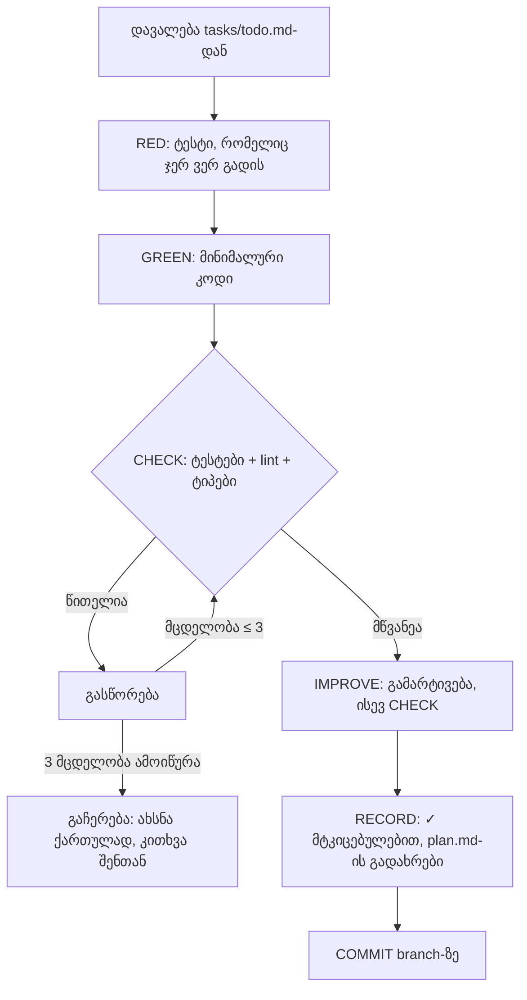
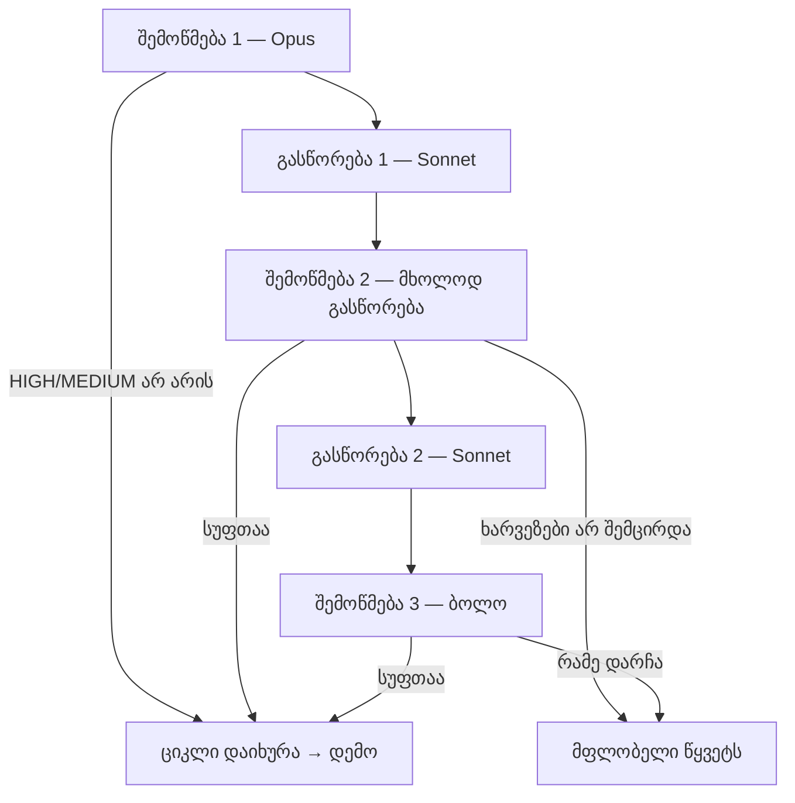

# ორკესტრაცია და კოდირების ციკლი — დიზაინი v0

> **სტატუსი:** ეტაპი 1 შენი ინსტრუქციით შეთანხმდა (2026-10-06) და ჩაიწერა [ADR-0003](../../docs/decisions/0003-model-orchestration-phase-1.md)-ში სტატუსით `proposed`. პარამეტრები harness-ის ეტაპზე ჩაირთვება.

## 1. ორი ცნება

**Loop (ციკლი)** აღწერს, როგორ მუშაობს კოდერი ერთ დავალებაზე: რა რიგით, რამდენჯერ ცდის და როდის ჩერდება. **ორკესტრაცია** აღწერს, ვინ რა როლს ასრულებს: რომელი მოდელი წერს, რომელი ურჩევს, რომელი ამოწმებს და როგორ გადასცემენ ერთმანეთს სამუშაოს.

## 2. როლები — ეტაპი 1

| როლი | მოდელი | effort | რას აკეთებს | რას არ აკეთებს |
|---|---|---|---|---|
| კოდერი (მთავარი სესია) | Sonnet 5.5 | high | წერს კოდსა და ტესტებს, უშვებს შემოწმებებს, ასწორებს | საკუთარ ნამუშევარს არ ამტკიცებს |
| მრჩეველი (advisor tool) | Opus 5.5 | — | რჩევას იძლევა გადამწყვეტ მომენტებში | ფაილებს არ ეხება |
| `architect` (subagent) | Opus 5.5 | high | გადაწყვეტილებისთვის 2–3 შემოწმებულ ვარიანტს ამზადებს | არ წყვეტს |
| `auditor` (subagent) | Opus 5.5 | high | დამოუკიდებლად ამოწმებს ყოველ კარიბჭესა და ეტაპს | არ ასწორებს, არ ამტკიცებს |
| `verifier` (subagent) | Sonnet 5.5 | medium | სუფთა კონტექსტში უშვებს მტკიცებულების ბრძანებებს | არ ასწორებს |
| `scout` (subagent, [ADR-0007](../../docs/decisions/0007-claude-only-orchestration.md)) | Haiku 5.5 | medium | პოულობს ფაქტებს: ვერსიას, ფასს, დოკუმენტაციის გვერდს, სად წერია რამე რეპოში | არ წყვეტს, არ ასწორებს; მის პასუხს უფრო ძლიერი მოდელი ამოწმებს |
| შენ | — | — | ამტკიცებ კარიბჭეებს, უყურებ დემოს | — |

**Advisor tool** Claude Code-ის ჩაშენებული, ჯერჯერობით ექსპერიმენტული ფუნქციაა: მთავარი მოდელი მუშაობის დროს თვითონ წყვეტს, როდის ჰკითხოს უფრო ძლიერ მოდელს. მრჩეველი მთელ საუბარს ხედავს და რჩევას აბრუნებს. დოკუმენტაციის მიხედვით ის განსაკუთრებით სასარგებლოა მიდგომის არჩევამდე, განმეორებითი შეცდომისას და დასრულების გამოცხადებამდე.

⚠ თუ API მოდელების წყვილს უარყოფს, Claude Code მრჩევლის გარეშე ჩუმად აგრძელებს. ამიტომ CLAUDE.md კოდერს ავალდებულებს, მრჩევლის დასკვნა ყოველ გადამწყვეტ წერტილზე დაასახელოს, აუდიტორი კი მის არარსებობას ხარვეზად ჩათვლის.

**Subagent** (დამხმარე აგენტი) ცალკე კონტექსტში მუშაობს და მთავარ სესიას მხოლოდ შედეგს უბრუნებს. ამიტომ აუდიტორი ავტორის დაშვებებს არ იზიარებს — ესაა playbook-ის „მოვალეობების გამიჯვნა": ვინც დაწერა, ის ვერ დაამტკიცებს.

## 3. ციკლი — ერთი დავალება



## 4. ეტაპის (milestone) კარიბჭე და Sonnet↔Opus ციკლი ([ADR-0006](../../docs/decisions/0006-engine-v2.md))

ეტაპის ბოლო დავალების შემდეგ `verifier` სუფთა კონტექსტში უშვებს ეტაპის მტკიცებულებას. შემდეგ იწყება მფლობელის ციკლი, რომელიც ზუსტად ორ გასწორებას უშვებს. `auditor` ცვლილებას ოთხი კუთხით ამოწმებს: შეცდომები, უსაფრთხოება, spec-თან და plan-თან შესაბამისობა და ის, ტესტები მართლა დაიჭერდნენ თუ არა გაფუჭებულ ქცევას. კოდერი მხოლოდ იმას ასწორებს, რასაც აუდიტორი მტკიცებულებით მიუთითებს. მეორე და მესამე შემოწმება მხოლოდ გასწორებას უყურებს: წინა ხარვეზი „გასწორდა" თუ „არ გასწორდა". ახალი შენიშვნა, რომელიც გასწორების გარეთაა, ციკლს არ აგრძელებს. იგივე ციკლი ტრიალებს ყოველ `[high-risk]` დავალებაზე.



რაუნდებს `sdlc/checks/review_rounds.py` ითვლის ჟურნალში `tasks/review-log.jsonl`. ყოველი შემოწმება და გასწორება იქ ერთ ხაზად იწერება, ამიტომ მესამე გასწორება ტექნიკურად შეუძლებელია და ციკლის მდგომარეობა მოდელის მეხსიერებაზე არ არის დამოკიდებული. LOW ხარვეზი იწერება, მაგრამ რაუნდს არ ხარჯავს. ბოლოს შენ გიჩვენებ დემოს: სად უნდა შეხედო, როგორ გამოიყურება წარმატება და როგორ — წარუმატებლობა. დამტკიცება შენი სიტყვით ხდება.

## 5. გამეორებების ლიმიტები

| სიტუაცია | ლიმიტი | შემდეგ |
|---|---|---|
| ერთი და იგივე შემოწმება ვერ გადის | 3 მცდელობა | ჩერდება, ქართულად გიხსნის, გეკითხება |
| აუდიტორის ხარვეზები (ეტაპი და `[high-risk]` დავალება) | 2 გასწორება + ბოლო შემოწმება; ადრე ჩერდება, თუ ხარვეზები არ მცირდება | ღია ხარვეზები შენთან მოდის, ეტაპი UNVERIFIED-ია შენს გადაწყვეტილებამდე |
| მრჩევლის კონსულტაცია | ლიმიტი არ არის (Claude წყვეტს) | — |
| პარალელური სესიები | ჯერ 1; მოგვიანებით 2–3 worktree-ით | playbook: იმდენი, რამდენის განხილვასაც ადამიანი ასწრებს |

## 6. ხარჯზე ფიქრი

მოცულობას Sonnet ატარებს; Opus მხოლოდ გადამწყვეტ წერტილებსა და კარიბჭეებზე ერთვება. Opus-ის აუდიტი ყოველ კარიბჭეზე შეგნებული ხარჯია. თუ ხარჯი პრობლემად იქცა, აუდიტის მოცულობას შევამცირებთ (მაგალითად, მხოლოდ ეტაპის დონეზე), მაგრამ მას არ გავაუქმებთ.

## 7. ეტაპი 2 — დოკუმენტირებული, არააქტიური

> **ჩანაცვლებულია (2026-10-08):** მფლობელმა გადაწყვიტა, რომ ძრავის როლებს მხოლოდ Claude-ის მოდელები ასრულებს, და [ADR-0007](../../docs/decisions/0007-claude-only-orchestration.md)-ის ვარიანტი A აირჩია. ქვემოთ მოცემული OpenAI-ისა და ღია მოდელების გეგმა ისტორიად რჩება.

- **კოდირება:** Opus 5.5 — მაღალი რისკის ან რთულად მონიშნული დავალებები; Sonnet 5.5 — დანარჩენი.
- **არქიტექტურა და review:** Fable 5.1 მრჩევლად და არქიტექტორად (დოკუმენტაციაში აღწერილია წყვილი „Sonnet main + Fable advisor"; საჭიროებს Fable-ზე წვდომას, ზოგ გეგმაზე usage credits-ით იხდება). OpenAI-ის მოდელი — სხვა მომწოდებლის მეორე reviewer, Codex plugin-ის გავლით (openai/codex-plugin-cc, დაყენებულია): ნაგულისხმევად `gpt-6.1-sol` (`/codex:adversarial-review`, 2$ / 10$ 1M ტოკენზე), ეტაპის აუდიტზე `gpt-6-astra` (10$ / 50$). სხვა მომწოდებელს სხვა „ბრმა წერტილი" აქვს, ამიტომ მისი შემოწმება ნამდვილად დამოუკიდებელია. „ChatGPT 6.1 Astra" OpenAI-ის კატალოგში არ არსებობს (შემოწმდა 2026-10-07).
- **ლოკალური/ღია მოდელი:** ჯერ API-ით — DeepSeek V4-Pro ან Qwen3-Coder-Next (OpenRouter-ზე ~0.12–0.30$ 1M შემავალ ტოკენზე); გაერთიანება სხვადასხვა მომწოდებლისთვის LiteLLM-ით. GPU-ს ქირაობა მხოლოდ მაშინ, თუ კოდი სხვის სერვერზე არ უნდა წავიდეს: RunPod, ერთი RTX PRO 6000 96 GB, Qwen3-Coder-Next 4-ბიტზე, ≈185$/თვე დღეში 4 საათზე; სათადარიგოდ Hetzner GEX131 ევროპაში. დეტალები და წყაროები: [models-gpu-graphs.md](../research/models-gpu-graphs.md).
- **როდის:** შენი გადაწყვეტილებით. შესაძლო სიგნალები: აუდიტის მიუხედავად ხარვეზები დემომდე აღწევს; მაღალი რისკის მოდულები (გადახდა, ავტორიზაცია, აგენტის ავტონომია); შეუქცევადი არქიტექტურული გადაწყვეტილებები.

## 8. ჩასართავი პარამეტრები (harness-ის ეტაპზე)

```json
{
  "model": "claude-sonnet-5-5",
  "modelSettings": { "claude-sonnet-5-5": { "effortLevel": "high" } },
  "advisorModel": "claude-opus-5-5"
}
```

აგენტების front matter უკვე დაწერილია `.claude/agents/`-ში: `architect` და `auditor` — `model: claude-opus-5-5`, `effort: high`; `verifier` — `model: claude-sonnet-5-5`, `effort: medium`. მოდელების სრული ID-ები დაფიქსირებულია, რათა მოდელი მხოლოდ ახალი ADR-ით შეიცვალოს და Claude Code-ის განახლებისას ჩუმად არ გადაერთოს.
